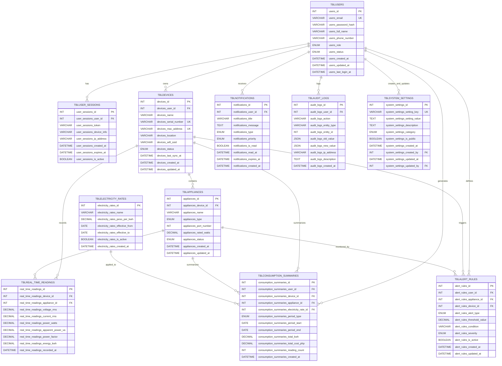

# NILM System - ERD in Mermaid Format for Draw.io Import

This ERD uses Mermaid notation and can be imported into Draw.io or viewed directly in GitHub.



## How to Use This ERD

### Option 1: View in GitHub
This file will automatically render the Mermaid diagram when viewed on GitHub.

### Option 2: Import to Draw.io
1. Copy the Mermaid code (between the ```mermaid tags)
2. Go to [Draw.io](https://app.diagrams.net/)
3. Create a new diagram
4. Go to **Arrange** → **Insert** → **Advanced** → **Mermaid**
5. Paste the Mermaid code
6. Click **Insert**

### Option 3: Use Mermaid Live Editor
1. Go to [Mermaid Live Editor](https://mermaid.live/)
2. Paste the Mermaid code
3. Export as PNG, SVG, or PDF

## Notes

- All table names use `TBL` prefix (uppercase for Mermaid)
- All column names follow `tablename_columnname` format
- Foreign keys are marked with `FK`
- Primary keys are marked with `PK`
- Unique keys are marked with `UK`
- All relationships include the audit trail fields for `TBLSYSTEM_SETTINGS`
- `TBLCONSUMPTION_SUMMARIES` includes the `consumption_summaries_electricity_rate_id` foreign key

## Critical Relationships

### Electricity Rates → Consumption Summaries
- **Relationship**: `TBLELECTRICITY_RATES` (1) → `TBLCONSUMPTION_SUMMARIES` (N)
- **Foreign Key**: `consumption_summaries_electricity_rate_id` → `electricity_rates_id`
- **Purpose**: Tracks which rate was used for each cost calculation, maintaining historical accuracy even when rates change over time
- **Constraint**: `ON DELETE RESTRICT` - Prevents deletion of rates that are referenced

### Real-Time Readings Relationships
- **Device Relationship**: `TBLDEVICES` (1) → `TBLREAL_TIME_READINGS` (N)
  - `real_time_readings_device_id` is **required** (NOT NULL)
  - Constraint: `ON DELETE CASCADE` - Readings deleted when device is deleted
- **Appliance Relationship**: `TBLAPPLIANCES` (1) → `TBLREAL_TIME_READINGS` (N)
  - `real_time_readings_appliance_id` is **nullable**
  - Constraint: `ON DELETE SET NULL` - Appliance ID set to NULL when appliance is deleted
  - Allows aggregate device readings (when `appliance_id = NULL`)
  - Preserves historical readings when appliances are removed

### System Settings Audit Trail
- `system_settings_created_by` - References `TBLUSERS` (who created the setting)
- `system_settings_updated_by` - References `TBLUSERS` (who last updated the setting)
- Both use `ON DELETE SET NULL` to preserve history if user is deleted

## Schema Consistency

This ERD matches exactly with:
- `schema.sql` - Authoritative MySQL schema
- `ERD.md` - Consolidated ERD documentation
- All relationships verified and correct

---

**Last Updated:** 2026  
**Version:** 1.0  
**Format:** Mermaid ERD for Draw.io Import  
**Status:** Verified and Consistent
