# NILM System - Database Design & ERD

## System Overview
This ERD represents a streamlined IoT-based Non-Intrusive Load Monitoring (NILM) system for residential appliances. The design focuses on core functionality: device management, real-time monitoring, consumption tracking, and user management.

## Entity Relationship Diagram (Crow's Foot Notation)

```mermaid
erDiagram
    %% ========================================
    %% USER MANAGEMENT ENTITIES
    %% ========================================
    
    tblusers {
        int users_id PK "Primary Key, Auto Increment"
        varchar users_email UK "Email Address, Unique"
        varchar users_password_hash "Hashed Password"
        varchar users_full_name "Full Name"
        varchar users_phone_number "Phone Number (Optional)"
        enum users_role "Role: admin, homeowner, tenant"
        enum users_status "Status: active, inactive, suspended"
        datetime users_created_at "Account Creation Timestamp"
        datetime users_updated_at "Last Update Timestamp"
        datetime users_last_login_at "Last Login Timestamp"
    }
    
    tbluser_sessions {
        int user_sessions_id PK "Primary Key, Auto Increment"
        int user_sessions_user_id FK "Foreign Key to tblusers"
        varchar user_sessions_token "Session Token (JWT)"
        varchar user_sessions_device_info "Device Information"
        varchar user_sessions_ip_address "IP Address"
        datetime user_sessions_created_at "Session Start Time"
        datetime user_sessions_expires_at "Session Expiry Time"
        boolean user_sessions_is_active "Active Status"
    }
    
    %% ========================================
    %% DEVICE AND APPLIANCE ENTITIES
    %% ========================================
    
    tbldevices {
        int devices_id PK "Primary Key, Auto Increment"
        int devices_user_id FK "Foreign Key to tblusers (Owner)"
        varchar devices_name "Device Name"
        varchar devices_serial_number UK "Serial Number, Unique"
        varchar devices_mac_address UK "MAC Address, Unique"
        varchar devices_location "Device Location (e.g., 'Living Room')"
        varchar devices_wifi_ssid "Connected WiFi SSID"
        enum devices_status "Status: online, offline, error"
        datetime devices_last_sync_at "Last Data Sync Timestamp"
        datetime devices_created_at "Device Registration Timestamp"
        datetime devices_updated_at "Last Update Timestamp"
    }
    
    tblappliances {
        int appliances_id PK "Primary Key, Auto Increment"
        int appliances_device_id FK "Foreign Key to tbldevices"
        varchar appliances_name "Appliance Name (e.g., 'Refrigerator')"
        enum appliances_type "Type: light, fan, refrigerator, ac, tv, other"
        int appliances_port_number "Port Number on Device"
        decimal appliances_rated_watts "Rated Power Consumption (Watts)"
        enum appliances_status "Status: on, off, unknown"
        datetime appliances_created_at "Appliance Registration Timestamp"
        datetime appliances_updated_at "Last Update Timestamp"
    }
    
    %% ========================================
    %% REAL-TIME READINGS ENTITIES
    %% ========================================
    
    tblreal_time_readings {
        int real_time_readings_id PK "Primary Key, Auto Increment"
        int real_time_readings_device_id FK "Foreign Key to tbldevices"
        int real_time_readings_appliance_id FK "Foreign Key to tblappliances (nullable for aggregate)"
        decimal real_time_readings_voltage_rms "Voltage RMS (V)"
        decimal real_time_readings_current_rms "Current RMS (A)"
        decimal real_time_readings_power_watts "Instantaneous Power (W)"
        decimal real_time_readings_apparent_power_va "Apparent Power (VA)"
        decimal real_time_readings_power_factor "Power Factor (Pf)"
        decimal real_time_readings_energy_kwh "Energy Consumption (kWh)"
        datetime real_time_readings_recorded_at "Reading Timestamp"
        index idx_recorded_at "Index on real_time_readings_recorded_at for time-series queries"
        index idx_device_appliance "Index on real_time_readings_device_id, real_time_readings_appliance_id"
    }
    
    %% ========================================
    %% CONSUMPTION SUMMARY ENTITIES
    %% ========================================
    
    tblconsumption_summaries {
        int consumption_summaries_id PK "Primary Key, Auto Increment"
        int consumption_summaries_user_id FK "Foreign Key to tblusers"
        int consumption_summaries_device_id FK "Foreign Key to tbldevices (nullable for user total)"
        int consumption_summaries_appliance_id FK "Foreign Key to tblappliances (nullable for device total)"
        int consumption_summaries_electricity_rate_id FK "Foreign Key to tblelectricity_rates (rate used for cost calculation)"
        enum consumption_summaries_period_type "Period Type: daily, weekly, monthly"
        date consumption_summaries_period_start "Period Start Date"
        date consumption_summaries_period_end "Period End Date"
        decimal consumption_summaries_total_kwh "Total Energy Consumption (kWh)"
        decimal consumption_summaries_total_cost_php "Total Cost (PHP) - Calculated using electricity rate"
        int consumption_summaries_reading_count "Number of Readings in Period"
        datetime consumption_summaries_created_at "Summary Creation Timestamp"
        unique uk_period "Unique constraint on (consumption_summaries_appliance_id, consumption_summaries_period_type, consumption_summaries_period_start)"
    }
    
    tblelectricity_rates {
        int electricity_rates_id PK "Primary Key, Auto Increment"
        varchar electricity_rates_name "Rate Name (e.g., 'Residential Rate 2026')"
        decimal electricity_rates_peso_per_kwh "Rate per kWh (PHP)"
        date electricity_rates_effective_from "Effective Start Date"
        date electricity_rates_effective_to "Effective End Date (nullable)"
        boolean electricity_rates_is_active "Active Status"
        datetime electricity_rates_created_at "Rate Creation Timestamp"
    }
    
    %% ========================================
    %% NOTIFICATION AND ALERT ENTITIES
    %% ========================================
    
    tblnotifications {
        int notifications_id PK "Primary Key, Auto Increment"
        int notifications_user_id FK "Foreign Key to tblusers"
        varchar notifications_title "Notification Title"
        text notifications_message "Notification Message"
        enum notifications_type "Type: alert, info, warning, error"
        enum notifications_priority "Priority: low, medium, high, critical"
        boolean notifications_is_read "Read Status"
        datetime notifications_read_at "Read Timestamp (nullable)"
        datetime notifications_expires_at "Expiry Timestamp (nullable)"
        datetime notifications_created_at "Notification Creation Timestamp"
        index idx_user_unread "Index on notifications_user_id, notifications_is_read for quick queries"
    }
    
    tblalert_rules {
        int alert_rules_id PK "Primary Key, Auto Increment"
        int alert_rules_user_id FK "Foreign Key to tblusers"
        int alert_rules_appliance_id FK "Foreign Key to tblappliances (nullable for device-level)"
        int alert_rules_device_id FK "Foreign Key to tbldevices (nullable for user-level)"
        enum alert_rules_alert_type "Type: power_threshold, consumption_limit, device_offline"
        decimal alert_rules_threshold_value "Threshold Value"
        varchar alert_rules_condition "Condition: >, <, >=, <="
        enum alert_rules_severity "Severity: low, medium, high, critical"
        boolean alert_rules_is_active "Active Status"
        datetime alert_rules_created_at "Rule Creation Timestamp"
        datetime alert_rules_updated_at "Last Update Timestamp"
    }
    
    %% ========================================
    %% AUDIT AND LOGGING ENTITIES
    %% ========================================
    
    tblaudit_logs {
        int audit_logs_id PK "Primary Key, Auto Increment"
        int audit_logs_user_id FK "Foreign Key to tblusers"
        varchar audit_logs_action "Action Performed (e.g., 'CREATE', 'UPDATE', 'DELETE')"
        varchar audit_logs_entity_type "Entity Type (e.g., 'device', 'appliance', 'user')"
        int audit_logs_entity_id "Entity ID"
        json audit_logs_old_value "Previous Value (JSON)"
        json audit_logs_new_value "New Value (JSON)"
        varchar audit_logs_ip_address "IP Address"
        text audit_logs_description "Action Description"
        datetime audit_logs_created_at "Log Timestamp"
        index idx_user_action "Index on audit_logs_user_id, audit_logs_action"
        index idx_entity "Index on audit_logs_entity_type, audit_logs_entity_id"
        index idx_created_at "Index on audit_logs_created_at"
    }
    
    %% ========================================
    %% SYSTEM CONFIGURATION ENTITIES
    %% ========================================
    
    tblsystem_settings {
        int system_settings_id PK "Primary Key, Auto Increment"
        varchar system_settings_setting_key UK "Setting Key, Unique"
        text system_settings_setting_value "Setting Value (JSON if complex)"
        text system_settings_description "Setting Description"
        enum system_settings_category "Category: general, billing, alerts, device"
        boolean system_settings_is_public "Public Setting (accessible to all users)"
        datetime system_settings_created_at "Creation Timestamp"
        int system_settings_created_by FK "Foreign Key to tblusers (who created)"
        datetime system_settings_updated_at "Last Update Timestamp"
        int system_settings_updated_by FK "Foreign Key to tblusers (who last updated)"
    }
    
    %% ========================================
    %% RELATIONSHIPS
    %% ========================================
    
    %% User Management Relationships
    tblusers ||--o{ tbluser_sessions : "has"
    tblusers ||--o{ tbldevices : "owns"
    tblusers ||--o{ tblconsumption_summaries : "has"
    tblusers ||--o{ tblnotifications : "receives"
    tblusers ||--o{ tblalert_rules : "creates"
    tblusers ||--o{ tblaudit_logs : "performs"
    tblusers ||--o{ tblsystem_settings : "manages"
    
    %% Device and Appliance Relationships
    tbldevices ||--o{ tblappliances : "contains"
    tbldevices ||--o{ tblreal_time_readings : "generates"
    tbldevices ||--o{ tblconsumption_summaries : "contributes_to"
    
    %% Appliance Relationships
    tblappliances ||--o{ tblreal_time_readings : "generates"
    tblappliances ||--o{ tblconsumption_summaries : "contributes_to"
    tblappliances ||--o{ tblalert_rules : "monitored_by"
    
    %% Consumption Summary Relationships
    tblelectricity_rates ||--o{ tblconsumption_summaries : "used_in"
```



## Key Design Decisions

### 1. **Simplified User Management**
- Removed separate `roles` table - using enum for simplicity
- Removed `login_attempts` - can be handled in application logic
- **Included `audit_logs`** - Required for capstone project compliance
- Kept `user_sessions` for mobile app authentication

### 2. **Streamlined Device Management**
- Single `devices` table with all device info
- `appliances` table linked to devices
- Removed `device_sync_logs` - can use `last_sync_at` in devices table
- Added `mac_address` for device identification

### 3. **Optimized Real-Time Readings**
- Single `real_time_readings` table for all readings
- `appliance_id` is nullable to support aggregate device readings
- Added indexes for time-series queries
- Includes all required parameters: V, I, W, VA, Pf

### 4. **Flexible Consumption Tracking**
- `consumption_summaries` supports multiple aggregation levels (appliance, device, user)
- Nullable foreign keys allow different summary types
- **`consumption_summaries_electricity_rate_id`** - Links to the rate used for cost calculation
- Unique constraint prevents duplicate summaries
- **Relationship**: `tblelectricity_rates` → `tblconsumption_summaries` (1:N)
  - Each summary references the specific rate that was active when the cost was calculated
  - This ensures historical accuracy even if rates change over time

### 5. **Electricity Rates Relationship**
- **`tblelectricity_rates`** stores historical and current electricity rates
- **`tblconsumption_summaries.consumption_summaries_electricity_rate_id`** references which rate was used
- Foreign key constraint: `ON DELETE RESTRICT` - prevents deletion of rates that are referenced
- This design allows:
  - Historical cost tracking with the exact rate used
  - Rate changes over time without affecting past calculations
  - Audit trail of which rate was applied to each summary

### 6. **Real-Time Readings Relationship**
- **`tblreal_time_readings`** links to both `tbldevices` and `tblappliances`
- `real_time_readings_device_id` is **required** (NOT NULL)
- `real_time_readings_appliance_id` is **nullable** - allows aggregate device readings
- Foreign key constraints:
  - Device: `ON DELETE CASCADE` - if device is deleted, readings are deleted
  - Appliance: `ON DELETE SET NULL` - if appliance is deleted, readings remain but appliance_id becomes NULL
- This design supports:
  - Appliance-specific readings (when appliance_id is set)
  - Device-level aggregate readings (when appliance_id is NULL)
  - Historical data preservation when appliances are removed

### 7. **Simplified Notifications**
- Removed separate `notification_reads` table - using `is_read` flag
- Single table with all notification data
- Indexed for efficient unread notification queries

### 8. **Removed Unnecessary Entities**
- ❌ `tbl_flow_steps` - Not relevant to NILM system
- ❌ `tbl_notification_reads` - Redundant with `is_read` flag
- ❌ `tbl_login_attempts` - Can be handled in app logic
- ❌ `tbl_device_sync_logs` - Using `last_sync_at` instead

### 9. **Audit Logging (Required)**
- ✅ `audit_logs` - Required for capstone project
- Tracks all user actions (CREATE, UPDATE, DELETE)
- Stores old and new values for change tracking
- Indexed for efficient querying

### 10. **System Settings with Audit Trail**
- `system_settings_created_by` - Tracks who created the setting
- `system_settings_updated_by` - Tracks who last updated the setting
- Both reference `tblusers` with `ON DELETE SET NULL` to preserve history

## Database Schema (SQL)

**Note:** This schema matches exactly with `schema.sql`. For the complete schema with views and seed data, see `schema.sql`.

### Core Tables

```sql
-- Users Table
CREATE TABLE tblusers (
    users_id INT PRIMARY KEY AUTO_INCREMENT,
    users_email VARCHAR(255) UNIQUE NOT NULL,
    users_password_hash VARCHAR(255) NOT NULL,
    users_full_name VARCHAR(255) NOT NULL,
    users_phone_number VARCHAR(20),
    users_role ENUM('admin', 'homeowner', 'tenant') DEFAULT 'homeowner',
    users_status ENUM('active', 'inactive', 'suspended') DEFAULT 'active',
    users_created_at DATETIME DEFAULT CURRENT_TIMESTAMP,
    users_updated_at DATETIME DEFAULT CURRENT_TIMESTAMP ON UPDATE CURRENT_TIMESTAMP,
    users_last_login_at DATETIME,
    INDEX idx_users_email (users_email),
    INDEX idx_users_status (users_status),
    INDEX idx_users_role (users_role)
);

-- User Sessions Table
CREATE TABLE tbluser_sessions (
    user_sessions_id INT PRIMARY KEY AUTO_INCREMENT,
    user_sessions_user_id INT NOT NULL,
    user_sessions_token VARCHAR(500) NOT NULL,
    user_sessions_device_info VARCHAR(255),
    user_sessions_ip_address VARCHAR(45),
    user_sessions_created_at DATETIME DEFAULT CURRENT_TIMESTAMP,
    user_sessions_expires_at DATETIME NOT NULL,
    user_sessions_is_active BOOLEAN DEFAULT TRUE,
    FOREIGN KEY (user_sessions_user_id) REFERENCES tblusers(users_id) ON DELETE CASCADE,
    INDEX idx_user_sessions_user_id (user_sessions_user_id),
    INDEX idx_user_sessions_token (user_sessions_token),
    INDEX idx_user_sessions_expires_at (user_sessions_expires_at)
);

-- Devices Table
CREATE TABLE tbldevices (
    devices_id INT PRIMARY KEY AUTO_INCREMENT,
    devices_user_id INT NOT NULL,
    devices_name VARCHAR(255) NOT NULL,
    devices_serial_number VARCHAR(100) UNIQUE NOT NULL,
    devices_mac_address VARCHAR(17) UNIQUE NOT NULL,
    devices_location VARCHAR(255),
    devices_wifi_ssid VARCHAR(255),
    devices_status ENUM('online', 'offline', 'error') DEFAULT 'offline',
    devices_last_sync_at DATETIME,
    devices_created_at DATETIME DEFAULT CURRENT_TIMESTAMP,
    devices_updated_at DATETIME DEFAULT CURRENT_TIMESTAMP ON UPDATE CURRENT_TIMESTAMP,
    FOREIGN KEY (devices_user_id) REFERENCES tblusers(users_id) ON DELETE CASCADE,
    INDEX idx_devices_user_id (devices_user_id),
    INDEX idx_devices_status (devices_status),
    INDEX idx_devices_serial_number (devices_serial_number)
);

-- Appliances Table
CREATE TABLE tblappliances (
    appliances_id INT PRIMARY KEY AUTO_INCREMENT,
    appliances_device_id INT NOT NULL,
    appliances_name VARCHAR(255) NOT NULL,
    appliances_type ENUM('light', 'fan', 'refrigerator', 'ac', 'tv', 'other') NOT NULL,
    appliances_port_number INT NOT NULL,
    appliances_rated_watts DECIMAL(10, 2),
    appliances_status ENUM('on', 'off', 'unknown') DEFAULT 'unknown',
    appliances_created_at DATETIME DEFAULT CURRENT_TIMESTAMP,
    appliances_updated_at DATETIME DEFAULT CURRENT_TIMESTAMP ON UPDATE CURRENT_TIMESTAMP,
    FOREIGN KEY (appliances_device_id) REFERENCES tbldevices(devices_id) ON DELETE CASCADE,
    INDEX idx_appliances_device_id (appliances_device_id),
    INDEX idx_appliances_status (appliances_status),
    INDEX idx_appliances_type (appliances_type)
);

-- Real-Time Readings Table
CREATE TABLE tblreal_time_readings (
    real_time_readings_id INT PRIMARY KEY AUTO_INCREMENT,
    real_time_readings_device_id INT NOT NULL,
    real_time_readings_appliance_id INT,
    real_time_readings_voltage_rms DECIMAL(10, 2) NOT NULL,
    real_time_readings_current_rms DECIMAL(10, 2) NOT NULL,
    real_time_readings_power_watts DECIMAL(10, 2) NOT NULL,
    real_time_readings_apparent_power_va DECIMAL(10, 2) NOT NULL,
    real_time_readings_power_factor DECIMAL(5, 4) NOT NULL,
    real_time_readings_energy_kwh DECIMAL(10, 6) NOT NULL,
    real_time_readings_recorded_at DATETIME NOT NULL,
    FOREIGN KEY (real_time_readings_device_id) REFERENCES tbldevices(devices_id) ON DELETE CASCADE,
    FOREIGN KEY (real_time_readings_appliance_id) REFERENCES tblappliances(appliances_id) ON DELETE SET NULL,
    INDEX idx_real_time_readings_recorded_at (real_time_readings_recorded_at),
    INDEX idx_real_time_readings_device_appliance (real_time_readings_device_id, real_time_readings_appliance_id),
    INDEX idx_real_time_readings_device_time (real_time_readings_device_id, real_time_readings_recorded_at),
    INDEX idx_real_time_readings_appliance_time (real_time_readings_appliance_id, real_time_readings_recorded_at)
);

-- Electricity Rates Table
CREATE TABLE tblelectricity_rates (
    electricity_rates_id INT PRIMARY KEY AUTO_INCREMENT,
    electricity_rates_name VARCHAR(255) NOT NULL,
    electricity_rates_peso_per_kwh DECIMAL(10, 4) NOT NULL,
    electricity_rates_effective_from DATE NOT NULL,
    electricity_rates_effective_to DATE,
    electricity_rates_is_active BOOLEAN DEFAULT TRUE,
    electricity_rates_created_at DATETIME DEFAULT CURRENT_TIMESTAMP,
    INDEX idx_electricity_rates_active (electricity_rates_is_active, electricity_rates_effective_from)
);

-- Consumption Summaries Table
CREATE TABLE tblconsumption_summaries (
    consumption_summaries_id INT PRIMARY KEY AUTO_INCREMENT,
    consumption_summaries_user_id INT NOT NULL,
    consumption_summaries_device_id INT,
    consumption_summaries_appliance_id INT,
    consumption_summaries_electricity_rate_id INT,
    consumption_summaries_period_type ENUM('daily', 'weekly', 'monthly') NOT NULL,
    consumption_summaries_period_start DATE NOT NULL,
    consumption_summaries_period_end DATE NOT NULL,
    consumption_summaries_total_kwh DECIMAL(10, 4) NOT NULL,
    consumption_summaries_total_cost_php DECIMAL(10, 2) NOT NULL,
    consumption_summaries_reading_count INT DEFAULT 0,
    consumption_summaries_created_at DATETIME DEFAULT CURRENT_TIMESTAMP,
    FOREIGN KEY (consumption_summaries_user_id) REFERENCES tblusers(users_id) ON DELETE CASCADE,
    FOREIGN KEY (consumption_summaries_device_id) REFERENCES tbldevices(devices_id) ON DELETE CASCADE,
    FOREIGN KEY (consumption_summaries_appliance_id) REFERENCES tblappliances(appliances_id) ON DELETE CASCADE,
    FOREIGN KEY (consumption_summaries_electricity_rate_id) REFERENCES tblelectricity_rates(electricity_rates_id) ON DELETE RESTRICT,
    UNIQUE KEY uk_consumption_period (consumption_summaries_appliance_id, consumption_summaries_period_type, consumption_summaries_period_start),
    INDEX idx_consumption_user_period (consumption_summaries_user_id, consumption_summaries_period_type, consumption_summaries_period_start),
    INDEX idx_consumption_device_period (consumption_summaries_device_id, consumption_summaries_period_type, consumption_summaries_period_start),
    INDEX idx_consumption_appliance_period (consumption_summaries_appliance_id, consumption_summaries_period_type, consumption_summaries_period_start),
    INDEX idx_consumption_rate (consumption_summaries_electricity_rate_id)
);

-- Notifications Table
CREATE TABLE tblnotifications (
    notifications_id INT PRIMARY KEY AUTO_INCREMENT,
    notifications_user_id INT NOT NULL,
    notifications_title VARCHAR(255) NOT NULL,
    notifications_message TEXT NOT NULL,
    notifications_type ENUM('alert', 'info', 'warning', 'error') DEFAULT 'info',
    notifications_priority ENUM('low', 'medium', 'high', 'critical') DEFAULT 'medium',
    notifications_is_read BOOLEAN DEFAULT FALSE,
    notifications_read_at DATETIME,
    notifications_expires_at DATETIME,
    notifications_created_at DATETIME DEFAULT CURRENT_TIMESTAMP,
    FOREIGN KEY (notifications_user_id) REFERENCES tblusers(users_id) ON DELETE CASCADE,
    INDEX idx_notifications_user_unread (notifications_user_id, notifications_is_read),
    INDEX idx_notifications_created_at (notifications_created_at),
    INDEX idx_notifications_type (notifications_type)
);

-- Alert Rules Table
CREATE TABLE tblalert_rules (
    alert_rules_id INT PRIMARY KEY AUTO_INCREMENT,
    alert_rules_user_id INT NOT NULL,
    alert_rules_appliance_id INT,
    alert_rules_device_id INT,
    alert_rules_alert_type ENUM('power_threshold', 'consumption_limit', 'device_offline') NOT NULL,
    alert_rules_threshold_value DECIMAL(10, 2) NOT NULL,
    alert_rules_condition VARCHAR(10) NOT NULL,
    alert_rules_severity ENUM('low', 'medium', 'high', 'critical') DEFAULT 'medium',
    alert_rules_is_active BOOLEAN DEFAULT TRUE,
    alert_rules_created_at DATETIME DEFAULT CURRENT_TIMESTAMP,
    alert_rules_updated_at DATETIME DEFAULT CURRENT_TIMESTAMP ON UPDATE CURRENT_TIMESTAMP,
    FOREIGN KEY (alert_rules_user_id) REFERENCES tblusers(users_id) ON DELETE CASCADE,
    FOREIGN KEY (alert_rules_appliance_id) REFERENCES tblappliances(appliances_id) ON DELETE CASCADE,
    FOREIGN KEY (alert_rules_device_id) REFERENCES tbldevices(devices_id) ON DELETE CASCADE,
    INDEX idx_alert_rules_user_active (alert_rules_user_id, alert_rules_is_active),
    INDEX idx_alert_rules_appliance_active (alert_rules_appliance_id, alert_rules_is_active)
);

-- Audit Logs Table
CREATE TABLE tblaudit_logs (
    audit_logs_id INT PRIMARY KEY AUTO_INCREMENT,
    audit_logs_user_id INT NOT NULL,
    audit_logs_action VARCHAR(50) NOT NULL,
    audit_logs_entity_type VARCHAR(50) NOT NULL,
    audit_logs_entity_id INT,
    audit_logs_old_value JSON,
    audit_logs_new_value JSON,
    audit_logs_ip_address VARCHAR(45),
    audit_logs_description TEXT,
    audit_logs_created_at DATETIME DEFAULT CURRENT_TIMESTAMP,
    FOREIGN KEY (audit_logs_user_id) REFERENCES tblusers(users_id) ON DELETE CASCADE,
    INDEX idx_audit_logs_user_action (audit_logs_user_id, audit_logs_action),
    INDEX idx_audit_logs_entity (audit_logs_entity_type, audit_logs_entity_id),
    INDEX idx_audit_logs_created_at (audit_logs_created_at)
);

-- System Settings Table
CREATE TABLE tblsystem_settings (
    system_settings_id INT PRIMARY KEY AUTO_INCREMENT,
    system_settings_setting_key VARCHAR(100) UNIQUE NOT NULL,
    system_settings_setting_value TEXT,
    system_settings_description TEXT,
    system_settings_category ENUM('general', 'billing', 'alerts', 'device') DEFAULT 'general',
    system_settings_is_public BOOLEAN DEFAULT FALSE,
    system_settings_created_at DATETIME DEFAULT CURRENT_TIMESTAMP,
    system_settings_created_by INT,
    system_settings_updated_at DATETIME DEFAULT CURRENT_TIMESTAMP ON UPDATE CURRENT_TIMESTAMP,
    system_settings_updated_by INT,
    FOREIGN KEY (system_settings_created_by) REFERENCES tblusers(users_id) ON DELETE SET NULL,
    FOREIGN KEY (system_settings_updated_by) REFERENCES tblusers(users_id) ON DELETE SET NULL,
    INDEX idx_system_settings_category (system_settings_category),
    INDEX idx_system_settings_key (system_settings_setting_key)
);
```

## Data Flow Summary

1. **Device Registration**: User registers device → `tbldevices` table → `tblaudit_logs` (action logged)
2. **Appliance Setup**: User configures appliances → `tblappliances` table → `tblaudit_logs` (action logged)
3. **Real-Time Data**: Hardware sends readings → `tblreal_time_readings` table
   - Readings can be appliance-specific (with `appliance_id`) or device-level aggregate (with `appliance_id = NULL`)
4. **Consumption Calculation**: System aggregates readings → `tblconsumption_summaries` table
   - System selects the active electricity rate at the time of calculation
   - Stores reference to rate in `consumption_summaries_electricity_rate_id`
5. **Billing**: System calculates cost using `tblelectricity_rates` → `tblconsumption_summaries.consumption_summaries_total_cost_php`
   - Each summary maintains a reference to the exact rate used for historical accuracy
6. **Alerts**: System checks `tblalert_rules` → creates `tblnotifications` if threshold exceeded
7. **Audit Trail**: All user actions (CREATE, UPDATE, DELETE) → `tblaudit_logs` table

## Critical Relationships Explained

### 1. Electricity Rates → Consumption Summaries
- **Relationship**: `tblelectricity_rates` (1) → `tblconsumption_summaries` (N)
- **Foreign Key**: `consumption_summaries_electricity_rate_id` → `electricity_rates_id`
- **Constraint**: `ON DELETE RESTRICT` - Prevents deletion of rates that are referenced
- **Purpose**: 
  - Tracks which rate was used for each cost calculation
  - Maintains historical accuracy even when rates change
  - Allows audit trail of billing calculations

### 2. Real-Time Readings Relationships
- **Device Relationship**: `tbldevices` (1) → `tblreal_time_readings` (N)
  - `real_time_readings_device_id` is **required** (NOT NULL)
  - Constraint: `ON DELETE CASCADE` - Readings deleted when device is deleted
- **Appliance Relationship**: `tblappliances` (1) → `tblreal_time_readings` (N)
  - `real_time_readings_appliance_id` is **nullable**
  - Constraint: `ON DELETE SET NULL` - Appliance ID set to NULL when appliance is deleted
  - Allows aggregate device readings (when `appliance_id = NULL`)
  - Preserves historical readings when appliances are removed

## Indexes for Performance

- **Time-series queries**: Indexes on `recorded_at` and composite indexes for device/appliance + time
- **User queries**: Indexes on `user_id` and status fields
- **Notification queries**: Composite index on `user_id` and `is_read` for unread notifications
- **Consumption queries**: Indexes on period types and dates for report generation
- **Rate queries**: Index on `electricity_rate_id` in consumption summaries for efficient joins

## Notes for Implementation

1. **Data Retention**: Consider archiving old `real_time_readings` data (e.g., keep only last 90 days, archive older data)
2. **Partitioning**: For production, consider partitioning `real_time_readings` by date
3. **Caching**: Cache `consumption_summaries` for faster report generation
4. **Backup**: Regular backups of `real_time_readings` and `consumption_summaries` are critical
5. **Rate Management**: When creating consumption summaries, always reference the active rate at the time of calculation
6. **Reading Aggregation**: System should support both appliance-specific and device-level aggregate readings

## Related Files

- **`schema.sql`** - Complete MySQL schema with views and seed data
- **`schema-postgresql.sql`** - PostgreSQL version of the schema
- **`ERD-mermaid-drawio.md`** - Mermaid format for Draw.io import
- **`ERD-drawio-import.sql`** - SQL format for Draw.io database import
- **`DRAWIO-IMPORT-INSTRUCTIONS.md`** - Instructions for importing ERD into Draw.io
- **`DRAWIO-LAYOUT-GUIDE.md`** - Guide for arranging tables in Draw.io

---

**Last Updated:** 2026  
**Version:** 1.0  
**Status:** Consolidated and Verified