# NILM System - Database Design & ERD

## System Overview
This ERD represents a streamlined IoT-based Non-Intrusive Load Monitoring (NILM) system for residential appliances. The design focuses on core functionality: device management, real-time monitoring, consumption tracking, and user management.

## Entity Relationship Diagram (Crow's Foot Notation)

```mermaid
erDiagram
    %% ========================================
    %% USER MANAGEMENT ENTITIES
    %% ========================================
    
    users {
        int user_id PK "Primary Key, Auto Increment"
        varchar email UK "Email Address, Unique"
        varchar password_hash "Hashed Password"
        varchar full_name "Full Name"
        varchar phone_number "Phone Number (Optional)"
        enum role "Role: admin, homeowner, tenant"
        enum status "Status: active, inactive, suspended"
        datetime created_at "Account Creation Timestamp"
        datetime updated_at "Last Update Timestamp"
        datetime last_login_at "Last Login Timestamp"
    }
    
    user_sessions {
        int session_id PK "Primary Key, Auto Increment"
        int user_id FK "Foreign Key to users"
        varchar token "Session Token (JWT)"
        varchar device_info "Device Information"
        varchar ip_address "IP Address"
        datetime created_at "Session Start Time"
        datetime expires_at "Session Expiry Time"
        boolean is_active "Active Status"
    }
    
    %% ========================================
    %% DEVICE AND APPLIANCE ENTITIES
    %% ========================================
    
    devices {
        int device_id PK "Primary Key, Auto Increment"
        int user_id FK "Foreign Key to users (Owner)"
        varchar device_name "Device Name"
        varchar device_serial_number UK "Serial Number, Unique"
        varchar mac_address UK "MAC Address, Unique"
        varchar location "Device Location (e.g., 'Living Room')"
        varchar wifi_ssid "Connected WiFi SSID"
        enum status "Status: online, offline, error"
        datetime last_sync_at "Last Data Sync Timestamp"
        datetime created_at "Device Registration Timestamp"
        datetime updated_at "Last Update Timestamp"
    }
    
    appliances {
        int appliance_id PK "Primary Key, Auto Increment"
        int device_id FK "Foreign Key to devices"
        varchar appliance_name "Appliance Name (e.g., 'Refrigerator')"
        varchar appliance_type "Type: light, fan, refrigerator, ac, tv, other"
        int port_number "Port Number on Device"
        decimal rated_watts "Rated Power Consumption (Watts)"
        enum status "Status: on, off, unknown"
        datetime created_at "Appliance Registration Timestamp"
        datetime updated_at "Last Update Timestamp"
    }
    
    %% ========================================
    %% REAL-TIME READINGS ENTITIES
    %% ========================================
    
    real_time_readings {
        int reading_id PK "Primary Key, Auto Increment"
        int device_id FK "Foreign Key to devices"
        int appliance_id FK "Foreign Key to appliances (nullable for aggregate)"
        decimal voltage_rms "Voltage RMS (V)"
        decimal current_rms "Current RMS (A)"
        decimal power_watts "Instantaneous Power (W)"
        decimal apparent_power_va "Apparent Power (VA)"
        decimal power_factor "Power Factor (Pf)"
        decimal energy_kwh "Energy Consumption (kWh)"
        datetime recorded_at "Reading Timestamp"
        index idx_recorded_at "Index on recorded_at for time-series queries"
        index idx_device_appliance "Index on device_id, appliance_id"
    }
    
    %% ========================================
    %% CONSUMPTION SUMMARY ENTITIES
    %% ========================================
    
    consumption_summaries {
        int summary_id PK "Primary Key, Auto Increment"
        int user_id FK "Foreign Key to users"
        int device_id FK "Foreign Key to devices (nullable for user total)"
        int appliance_id FK "Foreign Key to appliances (nullable for device total)"
        enum period_type "Period Type: daily, weekly, monthly"
        date period_start "Period Start Date"
        date period_end "Period End Date"
        decimal total_kwh "Total Energy Consumption (kWh)"
        decimal total_cost_php "Total Cost (PHP)"
        int reading_count "Number of Readings in Period"
        datetime created_at "Summary Creation Timestamp"
        unique uk_period "Unique constraint on (appliance_id, period_type, period_start)"
    }
    
    electricity_rates {
        int rate_id PK "Primary Key, Auto Increment"
        varchar rate_name "Rate Name (e.g., 'Residential Rate 2024')"
        decimal peso_per_kwh "Rate per kWh (PHP)"
        date effective_from "Effective Start Date"
        date effective_to "Effective End Date (nullable)"
        boolean is_active "Active Status"
        datetime created_at "Rate Creation Timestamp"
    }
    
    %% ========================================
    %% NOTIFICATION AND ALERT ENTITIES
    %% ========================================
    
    notifications {
        int notification_id PK "Primary Key, Auto Increment"
        int user_id FK "Foreign Key to users"
        varchar title "Notification Title"
        text message "Notification Message"
        enum type "Type: alert, info, warning, error"
        enum priority "Priority: low, medium, high, critical"
        boolean is_read "Read Status"
        datetime read_at "Read Timestamp (nullable)"
        datetime expires_at "Expiry Timestamp (nullable)"
        datetime created_at "Notification Creation Timestamp"
        index idx_user_unread "Index on user_id, is_read for quick queries"
    }
    
    alert_rules {
        int rule_id PK "Primary Key, Auto Increment"
        int user_id FK "Foreign Key to users"
        int appliance_id FK "Foreign Key to appliances (nullable for device-level)"
        int device_id FK "Foreign Key to devices (nullable for user-level)"
        enum alert_type "Type: power_threshold, consumption_limit, device_offline"
        decimal threshold_value "Threshold Value"
        varchar condition "Condition: >, <, >=, <="
        enum severity "Severity: low, medium, high, critical"
        boolean is_active "Active Status"
        datetime created_at "Rule Creation Timestamp"
        datetime updated_at "Last Update Timestamp"
    }
    
    %% ========================================
    %% AUDIT AND LOGGING ENTITIES
    %% ========================================
    
    audit_logs {
        int log_id PK "Primary Key, Auto Increment"
        int user_id FK "Foreign Key to users"
        varchar action "Action Performed (e.g., 'CREATE', 'UPDATE', 'DELETE')"
        varchar entity_type "Entity Type (e.g., 'device', 'appliance', 'user')"
        int entity_id "Entity ID"
        json old_value "Previous Value (JSON)"
        json new_value "New Value (JSON)"
        varchar ip_address "IP Address"
        text description "Action Description"
        datetime created_at "Log Timestamp"
        index idx_user_action "Index on user_id, action"
        index idx_entity "Index on entity_type, entity_id"
        index idx_created_at "Index on created_at"
    }
    
    %% ========================================
    %% SYSTEM CONFIGURATION ENTITIES
    %% ========================================
    
    system_settings {
        int setting_id PK "Primary Key, Auto Increment"
        varchar setting_key UK "Setting Key, Unique"
        text setting_value "Setting Value (JSON if complex)"
        text description "Setting Description"
        enum category "Category: general, billing, alerts, device"
        boolean is_public "Public Setting (accessible to all users)"
        datetime updated_at "Last Update Timestamp"
    }
    
    %% ========================================
    %% RELATIONSHIPS
    %% ========================================
    
    %% User Management Relationships
    users ||--o{ user_sessions : "has"
    users ||--o{ devices : "owns"
    users ||--o{ consumption_summaries : "has"
    users ||--o{ notifications : "receives"
    users ||--o{ alert_rules : "creates"
    users ||--o{ audit_logs : "performs"
    
    %% Device and Appliance Relationships
    devices ||--o{ appliances : "contains"
    devices ||--o{ real_time_readings : "generates"
    devices ||--o{ consumption_summaries : "contributes_to"
    
    %% Appliance Relationships
    appliances ||--o{ real_time_readings : "generates"
    appliances ||--o{ consumption_summaries : "contributes_to"
    appliances ||--o{ alert_rules : "monitored_by"
    
    %% Consumption Summary Relationships
    electricity_rates ||--o{ consumption_summaries : "used_in"
```



## Key Design Decisions

### 1. **Simplified User Management**
- Removed separate `roles` table - using enum for simplicity
- Removed `login_attempts` - can be handled in application logic
- **Included `audit_logs`** - Required for capstone project compliance
- Kept `user_sessions` for mobile app authentication

### 2. **Streamlined Device Management**
- Single `devices` table with all device info
- `appliances` table linked to devices
- Removed `device_sync_logs` - can use `last_sync_at` in devices table
- Added `mac_address` for device identification

### 3. **Optimized Real-Time Readings**
- Single `real_time_readings` table for all readings
- `appliance_id` is nullable to support aggregate device readings
- Added indexes for time-series queries
- Includes all required parameters: V, I, W, VA, Pf

### 4. **Flexible Consumption Tracking**
- `consumption_summaries` supports multiple aggregation levels (appliance, device, user)
- Nullable foreign keys allow different summary types
- Unique constraint prevents duplicate summaries

### 5. **Simplified Notifications**
- Removed separate `notification_reads` table - using `is_read` flag
- Single table with all notification data
- Indexed for efficient unread notification queries

### 6. **Removed Unnecessary Entities**
- ❌ `tbl_flow_steps` - Not relevant to NILM system
- ❌ `tbl_notification_reads` - Redundant with `is_read` flag
- ❌ `tbl_login_attempts` - Can be handled in app logic
- ❌ `tbl_device_sync_logs` - Using `last_sync_at` instead

### 7. **Audit Logging (Required)**
- ✅ `audit_logs` - Required for capstone project
- Tracks all user actions (CREATE, UPDATE, DELETE)
- Stores old and new values for change tracking
- Indexed for efficient querying

## Database Schema (SQL)

### Core Tables

```sql
-- Users Table
CREATE TABLE users (
    user_id INT PRIMARY KEY AUTO_INCREMENT,
    email VARCHAR(255) UNIQUE NOT NULL,
    password_hash VARCHAR(255) NOT NULL,
    full_name VARCHAR(255) NOT NULL,
    phone_number VARCHAR(20),
    role ENUM('admin', 'homeowner', 'tenant') DEFAULT 'homeowner',
    status ENUM('active', 'inactive', 'suspended') DEFAULT 'active',
    created_at DATETIME DEFAULT CURRENT_TIMESTAMP,
    updated_at DATETIME DEFAULT CURRENT_TIMESTAMP ON UPDATE CURRENT_TIMESTAMP,
    last_login_at DATETIME,
    INDEX idx_email (email),
    INDEX idx_status (status)
);

-- Devices Table
CREATE TABLE devices (
    device_id INT PRIMARY KEY AUTO_INCREMENT,
    user_id INT NOT NULL,
    device_name VARCHAR(255) NOT NULL,
    device_serial_number VARCHAR(100) UNIQUE NOT NULL,
    mac_address VARCHAR(17) UNIQUE NOT NULL,
    location VARCHAR(255),
    wifi_ssid VARCHAR(255),
    status ENUM('online', 'offline', 'error') DEFAULT 'offline',
    last_sync_at DATETIME,
    created_at DATETIME DEFAULT CURRENT_TIMESTAMP,
    updated_at DATETIME DEFAULT CURRENT_TIMESTAMP ON UPDATE CURRENT_TIMESTAMP,
    FOREIGN KEY (user_id) REFERENCES users(user_id) ON DELETE CASCADE,
    INDEX idx_user_id (user_id),
    INDEX idx_status (status)
);

-- Appliances Table
CREATE TABLE appliances (
    appliance_id INT PRIMARY KEY AUTO_INCREMENT,
    device_id INT NOT NULL,
    appliance_name VARCHAR(255) NOT NULL,
    appliance_type ENUM('light', 'fan', 'refrigerator', 'ac', 'tv', 'other') NOT NULL,
    port_number INT NOT NULL,
    rated_watts DECIMAL(10, 2),
    status ENUM('on', 'off', 'unknown') DEFAULT 'unknown',
    created_at DATETIME DEFAULT CURRENT_TIMESTAMP,
    updated_at DATETIME DEFAULT CURRENT_TIMESTAMP ON UPDATE CURRENT_TIMESTAMP,
    FOREIGN KEY (device_id) REFERENCES devices(device_id) ON DELETE CASCADE,
    INDEX idx_device_id (device_id),
    INDEX idx_status (status)
);

-- Real-Time Readings Table
CREATE TABLE real_time_readings (
    reading_id INT PRIMARY KEY AUTO_INCREMENT,
    device_id INT NOT NULL,
    appliance_id INT,
    voltage_rms DECIMAL(10, 2) NOT NULL,
    current_rms DECIMAL(10, 2) NOT NULL,
    power_watts DECIMAL(10, 2) NOT NULL,
    apparent_power_va DECIMAL(10, 2) NOT NULL,
    power_factor DECIMAL(5, 4) NOT NULL,
    energy_kwh DECIMAL(10, 6) NOT NULL,
    recorded_at DATETIME NOT NULL,
    FOREIGN KEY (device_id) REFERENCES devices(device_id) ON DELETE CASCADE,
    FOREIGN KEY (appliance_id) REFERENCES appliances(appliance_id) ON DELETE SET NULL,
    INDEX idx_recorded_at (recorded_at),
    INDEX idx_device_appliance (device_id, appliance_id),
    INDEX idx_device_time (device_id, recorded_at)
);

-- Consumption Summaries Table
CREATE TABLE consumption_summaries (
    summary_id INT PRIMARY KEY AUTO_INCREMENT,
    user_id INT NOT NULL,
    device_id INT,
    appliance_id INT,
    period_type ENUM('daily', 'weekly', 'monthly') NOT NULL,
    period_start DATE NOT NULL,
    period_end DATE NOT NULL,
    total_kwh DECIMAL(10, 4) NOT NULL,
    total_cost_php DECIMAL(10, 2) NOT NULL,
    reading_count INT DEFAULT 0,
    created_at DATETIME DEFAULT CURRENT_TIMESTAMP,
    FOREIGN KEY (user_id) REFERENCES users(user_id) ON DELETE CASCADE,
    FOREIGN KEY (device_id) REFERENCES devices(device_id) ON DELETE CASCADE,
    FOREIGN KEY (appliance_id) REFERENCES appliances(appliance_id) ON DELETE CASCADE,
    UNIQUE KEY uk_period (appliance_id, period_type, period_start),
    INDEX idx_user_period (user_id, period_type, period_start),
    INDEX idx_device_period (device_id, period_type, period_start)
);

-- Electricity Rates Table
CREATE TABLE electricity_rates (
    rate_id INT PRIMARY KEY AUTO_INCREMENT,
    rate_name VARCHAR(255) NOT NULL,
    peso_per_kwh DECIMAL(10, 4) NOT NULL,
    effective_from DATE NOT NULL,
    effective_to DATE,
    is_active BOOLEAN DEFAULT TRUE,
    created_at DATETIME DEFAULT CURRENT_TIMESTAMP,
    INDEX idx_active (is_active, effective_from)
);

-- Notifications Table
CREATE TABLE notifications (
    notification_id INT PRIMARY KEY AUTO_INCREMENT,
    user_id INT NOT NULL,
    title VARCHAR(255) NOT NULL,
    message TEXT NOT NULL,
    type ENUM('alert', 'info', 'warning', 'error') DEFAULT 'info',
    priority ENUM('low', 'medium', 'high', 'critical') DEFAULT 'medium',
    is_read BOOLEAN DEFAULT FALSE,
    read_at DATETIME,
    expires_at DATETIME,
    created_at DATETIME DEFAULT CURRENT_TIMESTAMP,
    FOREIGN KEY (user_id) REFERENCES users(user_id) ON DELETE CASCADE,
    INDEX idx_user_unread (user_id, is_read),
    INDEX idx_created_at (created_at)
);

-- Alert Rules Table
CREATE TABLE alert_rules (
    rule_id INT PRIMARY KEY AUTO_INCREMENT,
    user_id INT NOT NULL,
    appliance_id INT,
    device_id INT,
    alert_type ENUM('power_threshold', 'consumption_limit', 'device_offline') NOT NULL,
    threshold_value DECIMAL(10, 2) NOT NULL,
    condition VARCHAR(10) NOT NULL,
    severity ENUM('low', 'medium', 'high', 'critical') DEFAULT 'medium',
    is_active BOOLEAN DEFAULT TRUE,
    created_at DATETIME DEFAULT CURRENT_TIMESTAMP,
    updated_at DATETIME DEFAULT CURRENT_TIMESTAMP ON UPDATE CURRENT_TIMESTAMP,
    FOREIGN KEY (user_id) REFERENCES users(user_id) ON DELETE CASCADE,
    FOREIGN KEY (appliance_id) REFERENCES appliances(appliance_id) ON DELETE CASCADE,
    FOREIGN KEY (device_id) REFERENCES devices(device_id) ON DELETE CASCADE,
    INDEX idx_user_active (user_id, is_active)
);

-- Audit Logs Table
CREATE TABLE audit_logs (
    log_id INT PRIMARY KEY AUTO_INCREMENT,
    user_id INT NOT NULL,
    action VARCHAR(50) NOT NULL,
    entity_type VARCHAR(50) NOT NULL,
    entity_id INT,
    old_value JSON,
    new_value JSON,
    ip_address VARCHAR(45),
    description TEXT,
    created_at DATETIME DEFAULT CURRENT_TIMESTAMP,
    FOREIGN KEY (user_id) REFERENCES users(user_id) ON DELETE CASCADE,
    INDEX idx_user_action (user_id, action),
    INDEX idx_entity (entity_type, entity_id),
    INDEX idx_created_at (created_at)
);

-- System Settings Table
CREATE TABLE system_settings (
    setting_id INT PRIMARY KEY AUTO_INCREMENT,
    setting_key VARCHAR(100) UNIQUE NOT NULL,
    setting_value TEXT,
    description TEXT,
    category ENUM('general', 'billing', 'alerts', 'device') DEFAULT 'general',
    is_public BOOLEAN DEFAULT FALSE,
    updated_at DATETIME DEFAULT CURRENT_TIMESTAMP ON UPDATE CURRENT_TIMESTAMP
);
```

## Data Flow Summary

1. **Device Registration**: User registers device → `devices` table → `audit_logs` (action logged)
2. **Appliance Setup**: User configures appliances → `appliances` table → `audit_logs` (action logged)
3. **Real-Time Data**: Hardware sends readings → `real_time_readings` table
4. **Consumption Calculation**: System aggregates readings → `consumption_summaries` table
5. **Billing**: System calculates cost using `electricity_rates` → `consumption_summaries.total_cost_php`
6. **Alerts**: System checks `alert_rules` → creates `notifications` if threshold exceeded
7. **Audit Trail**: All user actions (CREATE, UPDATE, DELETE) → `audit_logs` table

## Indexes for Performance

- **Time-series queries**: Indexes on `recorded_at` and composite indexes for device/appliance + time
- **User queries**: Indexes on `user_id` and status fields
- **Notification queries**: Composite index on `user_id` and `is_read` for unread notifications
- **Consumption queries**: Indexes on period types and dates for report generation

## Notes for Implementation

1. **Data Retention**: Consider archiving old `real_time_readings` data (e.g., keep only last 90 days, archive older data)
2. **Partitioning**: For production, consider partitioning `real_time_readings` by date
3. **Caching**: Cache `consumption_summaries` for faster report generation
4. **Backup**: Regular backups of `real_time_readings` and `consumption_summaries` are critical

