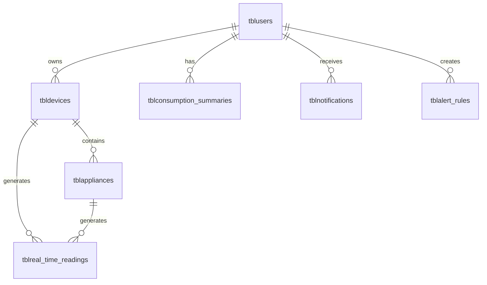

# NILM System - Database Design Documentation

[](ERD.md)
[](schema-firestore.md)
[](schema.sql)

Complete database design documentation for the **Non-Intrusive Load Monitoring (NILM)** system. This includes Entity Relationship Diagrams (ERD), database schemas, API documentation, and implementation guides.

## 📋 Table of Contents

- [Quick Overview](#-quick-overview)
- [Database Schema](#-database-schema)
- [Documentation Files](#-documentation-files)
- [Getting Started](#-getting-started)
- [Technology Stack](#-technology-stack)
- [Key Features](#-key-features)

---

## 🚀 Quick Overview

### Database Statistics
- **Total Tables**: 11 core tables
- **Design Approach**: Normalized (3NF)
- **Optimization**: Strategic indexes for time-series data
- **Database Options**: Firebase Firestore (recommended) or SQL (PostgreSQL/MySQL)

### Core Entities

| Category | Tables | Description |
|----------|--------|-------------|
| **User Management** | `tblusers`, `tbluser_sessions` | Authentication and session management |
| **Device Management** | `tbldevices`, `tblappliances` | IoT device and appliance configuration |
| **Data Collection** | `tblreal_time_readings` | Time-series electrical measurements |
| **Consumption & Billing** | `tblconsumption_summaries`, `tblelectricity_rates` | Aggregated data and billing rates |
| **Notifications** | `tblnotifications`, `tblalert_rules` | Alert system and notifications |
| **Audit & Config** | `tblaudit_logs`, `tblsystem_settings` | Audit trail and system configuration |

---

## 📊 Database Schema

### Entity Relationship Diagram

View the complete ERD: **[ERD.md](ERD.md)**



### Quick Start Schemas

- **[MySQL Schema](schema.sql)** - Ready-to-use MySQL database schema
- **[PostgreSQL Schema](schema-postgresql.sql)** - Ready-to-use PostgreSQL database schema
- **[Firestore Schema](schema-firestore.md)** - NoSQL schema with implementation guide ⭐ **Recommended**

---

## 📁 Documentation Files

### Core Documentation

| File | Description | Status |
|------|-------------|--------|
| **[ERD.md](ERD.md)** | Complete Entity Relationship Diagram with Mermaid notation | ✅ Complete |
| **[system-flowchart.md](system-flowchart.md)** | System flowcharts and data flow diagrams | ✅ Complete |
| **[EXECUTIVE-SUMMARY.md](EXECUTIVE-SUMMARY.md)** | Executive summary for initial paper submission | ✅ Complete |
| **[CAPSTONE-ASSESSMENT.md](CAPSTONE-ASSESSMENT.md)** | Database design assessment for capstone/thesis | ✅ Complete |

### Database Schemas

| File | Description | Use Case |
|------|-------------|----------|
| **[schema.sql](schema.sql)** | MySQL database schema | SQL implementation |
| **[schema-postgresql.sql](schema-postgresql.sql)** | PostgreSQL database schema | SQL implementation |
| **[schema-firestore.md](schema-firestore.md)** | Firestore NoSQL schema ⭐ | **Recommended for NILM** |

### ERD Import Files (Draw.io)

| File | Description |
|------|-------------|
| **[ERD-drawio-import.sql](ERD-drawio-import.sql)** | Full SQL schema for Draw.io import |
| **[ERD-drawio-simplified.sql](ERD-drawio-simplified.sql)** | Simplified SQL (no ENUM/JSON) for compatibility |
| **[ERD-text-visual.txt](ERD-text-visual.txt)** | Text representation for manual creation |
| **[DRAWIO-IMPORT-INSTRUCTIONS.md](DRAWIO-IMPORT-INSTRUCTIONS.md)** | Step-by-step import guide |

### Implementation Guides

| File | Description |
|------|-------------|
| **[API-endpoints-reference.md](API-endpoints-reference.md)** | Complete REST API documentation |
| **[IOT-COMMUNICATION-GUIDE.md](IOT-COMMUNICATION-GUIDE.md)** | Hardware integration guide (Arduino/ESP32) ⭐ |
| **[tech-stack-recommendations.md](tech-stack-recommendations.md)** | Technology stack recommendations |
| **[FIRESTORE-DECISION.md](FIRESTORE-DECISION.md)** | Rationale for choosing Firestore |

### Design Documentation

| File | Description |
|------|-------------|
| **[DESIGN-DECISIONS.md](DESIGN-DECISIONS.md)** | Consolidated design decisions, improvements, and analysis ⭐ |
| **[README.md](README.md)** | This file |

---

## 🛠️ Getting Started

### 1. Choose Your Database

#### Option 1: Firebase Firestore (Recommended) ⭐

**Why Firestore?**
- ✅ Built-in real-time listeners (perfect for IoT)
- ✅ Offline support
- ✅ Easy integration with React Native
- ✅ Free tier: 50K reads, 20K writes/day

**Setup:**
1. Read [FIRESTORE-DECISION.md](FIRESTORE-DECISION.md) for rationale
2. Follow [schema-firestore.md](schema-firestore.md) for implementation
3. Set up Firebase project and enable Firestore

#### Option 2: SQL Database (PostgreSQL/MySQL)

**Why SQL?**
- ✅ Traditional relational database
- ✅ Complex queries and ACID transactions
- ✅ Time-series optimization

**Setup:**
1. Choose MySQL or PostgreSQL
2. Use [schema.sql](schema.sql) for MySQL
3. Use [schema-postgresql.sql](schema-postgresql.sql) for PostgreSQL
4. Set up database on Supabase, Railway, or PlanetScale

### 2. Review Database Design

1. **Start with ERD**: Read [ERD.md](ERD.md) to understand relationships
2. **Review Flowcharts**: Check [system-flowchart.md](system-flowchart.md) for data flow
3. **Understand Design**: Read [DESIGN-DECISIONS.md](DESIGN-DECISIONS.md) for design decisions and rationale

### 3. Set Up Database

**For Firestore:**
```bash
# Follow instructions in schema-firestore.md
# Set up Firebase project
# Configure Firestore security rules
```

**For SQL:**
```bash
# MySQL
mysql -u root -p < schema.sql

# PostgreSQL
psql -U postgres -d nilm_db -f schema-postgresql.sql
```

### 4. Implement Backend API

- Review [API-endpoints-reference.md](API-endpoints-reference.md)
- Set up backend (Firebase Cloud Functions or Node.js/Express)
- Implement authentication endpoints
- Implement device and data endpoints

### 5. Integrate Hardware

- Follow [IOT-COMMUNICATION-GUIDE.md](IOT-COMMUNICATION-GUIDE.md)
- Set up ESP32/Arduino with sensors
- Configure HTTP REST API communication
- Test data submission

---

## 💻 Technology Stack

### Recommended Stack

| Component | Technology | Documentation |
|-----------|-----------|--------------|
| **Database** | Firebase Firestore ⭐ | [schema-firestore.md](schema-firestore.md) |
| **Backend API** | Firebase Cloud Functions | [API-endpoints-reference.md](API-endpoints-reference.md) |
| **Authentication** | Firebase Authentication | [tech-stack-recommendations.md](tech-stack-recommendations.md) |
| **Real-Time** | Firestore Real-time Listeners | Built-in with Firestore |
| **File Storage** | Cloudinary | [tech-stack-recommendations.md](tech-stack-recommendations.md) |
| **Mobile App** | React Native + Expo | See [main project README](../../README.md) |

### Alternative Stack (SQL)

| Component | Technology | Documentation |
|-----------|-----------|--------------|
| **Database** | PostgreSQL or MySQL | [schema.sql](schema.sql) or [schema-postgresql.sql](schema-postgresql.sql) |
| **Backend API** | Node.js + Express | [API-endpoints-reference.md](API-endpoints-reference.md) |
| **Authentication** | JWT (JSON Web Tokens) | [tech-stack-recommendations.md](tech-stack-recommendations.md) |
| **Real-Time** | WebSockets (Socket.io) | [tech-stack-recommendations.md](tech-stack-recommendations.md) |

See [tech-stack-recommendations.md](tech-stack-recommendations.md) for detailed recommendations.

---

## ✨ Key Features

### Database Design Highlights

✅ **Normalized Design** - Proper 3NF normalization  
✅ **Time-Series Optimization** - Strategic indexes for real-time readings  
✅ **Scalable Architecture** - Supports multiple users, devices, and appliances  
✅ **Flexible Aggregation** - Multi-level consumption summaries (appliance/device/user)  
✅ **Audit Trail** - Complete audit logging for compliance  
✅ **Real-Time Ready** - Optimized for high-frequency IoT data insertion  

### Design Principles

- **Simplicity**: Streamlined from 15 to 11 tables (27% reduction)
- **Performance**: Strategic indexes on time-series and foreign keys
- **Integrity**: Foreign key constraints with CASCADE rules
- **Scalability**: Designed to handle growth in users and devices

---

## 📊 Database Statistics

### Table Breakdown

```
Total Tables: 11
├── User Management: 2 tables
├── Device Management: 2 tables
├── Data Collection: 1 table
├── Consumption & Billing: 2 tables
├── Notifications: 2 tables
└── System: 2 tables
```

### Design Metrics

- **Normalization Level**: 3NF (Third Normal Form)
- **Indexes**: 15+ strategic indexes
- **Foreign Keys**: 12 relationships
- **Unique Constraints**: 4 unique constraints

---

## 🎓 For Academic Submission

This database design documentation is suitable for:

- ✅ **Initial Proposal Submission** - Present ERD and flowcharts
- ✅ **System Design Chapter** - Include in thesis Chapter 3
- ✅ **Database Design Chapter** - Complete ERD and schema
- ✅ **Academic Defense** - Explain design decisions and normalization

### Recommended Files for Submission

1. **ERD.md** - Entity Relationship Diagram
2. **system-flowchart.md** - System flowcharts
3. **EXECUTIVE-SUMMARY.md** - Project overview
4. **CAPSTONE-ASSESSMENT.md** - Design assessment
5. **schema.sql** or **schema-firestore.md** - Database schema

### Diagram Formats

- **Mermaid ERD**: Renders in GitHub, can export to images
- **Draw.io**: Import SQL files for professional diagrams
- **Text Visual**: For quick reference or manual creation

---

## 🔗 Related Documentation

- **[Main Project README](../../README.md)** - Project overview
- **[Thesis Documentation](../thesis-documentation/)** - Complete thesis chapters
- **[Mobile App Prototype](../mobile-app-prototype/)** - UI/UX mockups

---

## 📝 Design Decisions

### Why 11 Tables?

The database was streamlined from an initial 15-table design to focus on core functionality:

- ✅ **Appropriate Complexity** - Perfect for capstone/thesis projects
- ✅ **Complete Functionality** - All requirements met
- ✅ **Professional Quality** - Follows database design best practices
- ✅ **Easy Implementation** - Realistic scope for development

See [DESIGN-DECISIONS.md](DESIGN-DECISIONS.md) for detailed rationale.

### Why Firestore?

Firestore is recommended for NILM because:

- ✅ **Real-Time Built-In** - Perfect for IoT monitoring
- ✅ **Offline Support** - Mobile app works offline
- ✅ **Easy Integration** - Simple React Native integration
- ✅ **Scalable** - Handles high-frequency data insertion

See [FIRESTORE-DECISION.md](FIRESTORE-DECISION.md) for complete analysis.

---

## ❓ FAQ

### Is this database design sufficient for a capstone/thesis?

**Yes!** See [CAPSTONE-ASSESSMENT.md](CAPSTONE-ASSESSMENT.md) for complete assessment. The 11-table design is:
- ✅ Appropriate complexity (8-15 tables is ideal)
- ✅ Complete functionality coverage
- ✅ Professional quality
- ✅ Well-documented

### Which database should I use?

**Firebase Firestore is recommended** for NILM because of built-in real-time capabilities. However, SQL (PostgreSQL/MySQL) is also supported. See [FIRESTORE-DECISION.md](FIRESTORE-DECISION.md) for comparison.

### How do I import the ERD into Draw.io?

Follow the step-by-step guide: [DRAWIO-IMPORT-INSTRUCTIONS.md](DRAWIO-IMPORT-INSTRUCTIONS.md)

### Can I add more tables?

The current design is sufficient for capstone requirements. Only add tables if:
- Required by your academic adviser
- Necessary for specific functionality
- You have extra development time

See [DESIGN-DECISIONS.md](DESIGN-DECISIONS.md) for design rationale.

---

## 📧 Support

For questions about the database design:
1. Review the relevant documentation file
2. Check [DESIGN-DECISIONS.md](DESIGN-DECISIONS.md) for design decisions and analysis
3. See [CAPSTONE-ASSESSMENT.md](CAPSTONE-ASSESSMENT.md) for assessment

---

## 📄 License

This database design is part of an academic capstone/thesis project.

---

**Last Updated**: 2026  
**Status**: ✅ Ready for Implementation  
**Database Design**: Complete and Documented
