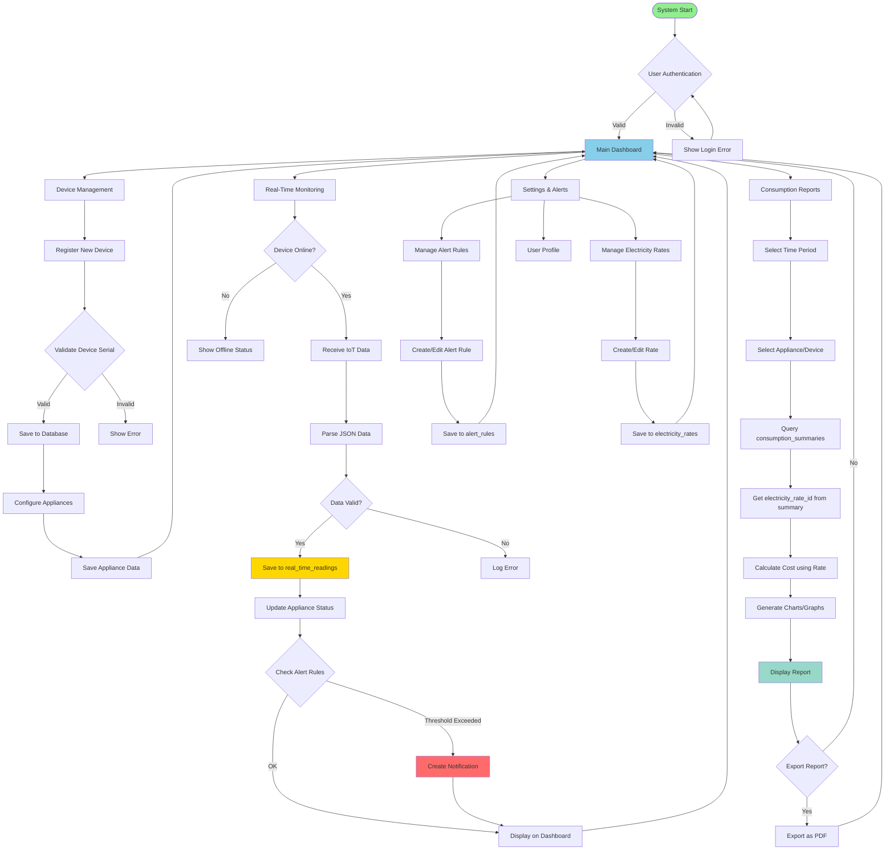
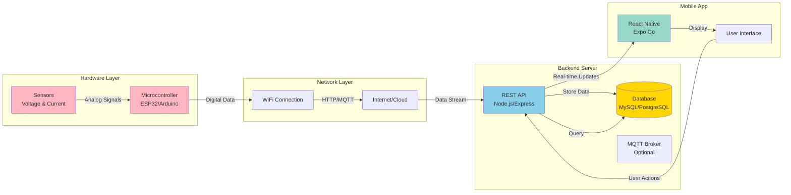
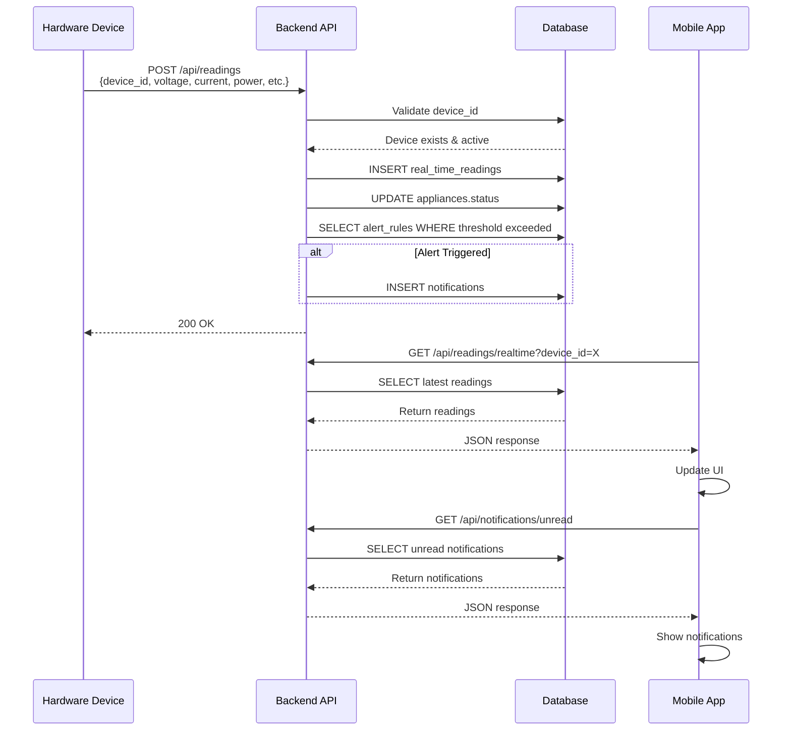
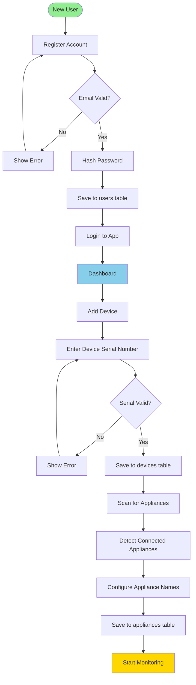
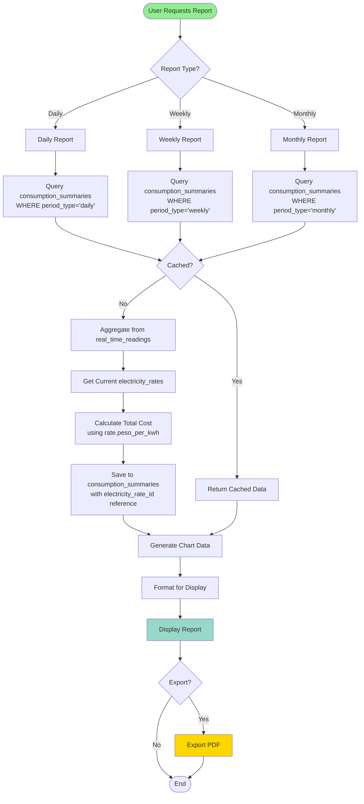

# NILM System - System Flowchart

## System Architecture Flow

## Data Flow Diagram

## IoT Data Collection Flow

## User Registration & Device Setup Flow

## Consumption Report Generation Flow

